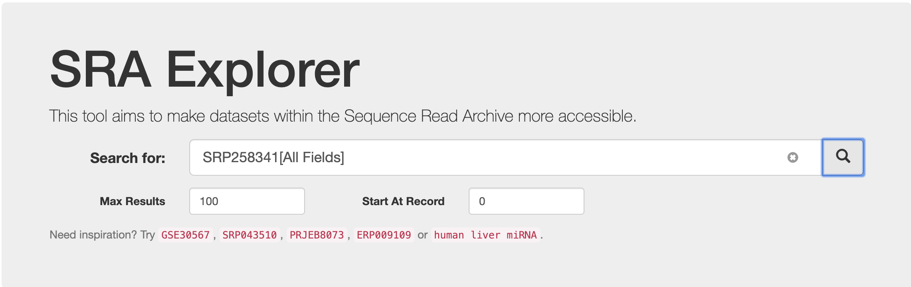

<h2 align = "center">SRA-Explorer+Aspera才是打开SRA的正确方式！</h2>

自从去年NCBI取消SRA对FTP下载的支持后，下载SRA公共数据变的麻烦起来，也慢了很多，虽然prefecth直接通过SRR号直接下载数据，但是也取消了对FTP的支持，只能通过HTTPS方式下载，速度巨慢。虽然NCBI提供了AWS和google下载方式，但是两者注册比较麻烦，基本上是收费的。

以前的NCBI SRA支持Aspera方式高速下载，速度基本维持在100Mb/s左右。但是目前的SRA取消对FTP支持后，直接无法通过anonftp@ftp.ncbi.nlm.nih.gov获取到SRA的数据。

那么问题来了，到底还有没有好的SRA下载方式呢？ 答案是有的，而且很方便。

我们以一篇最新的Scientific Data文章为例，演示怎么快速下载SRA数据。

文章测了五个物种的基因组数据，而且是通过PacBio HIFI 测序方法。

文章提供的中SRA编号是：**SRP258341**

我们请上今天的主角：[SRA Explorer](https://sra-explorer.info/#) https://sra-explorer.info/ 

直接输入**SRP258341**

得到19条记录：

依次操作，加入购物车：

然后可以直接选择下载fastq格式的文件，而无需下载SRA格式，还得通过fasterq-dump转化格式。很方便，是不是？

点进去，发现SRA Explorer已经给出了下载脚本，还能直接修改下载的数据名字，添加了物种，数据类型等信息。非常地人性化。

通过Copy或者Download就可以得到下载的脚本，竟然同时支持Linux和MacOS系统，后者需要打开终端操作。

当然，如果只对HiFi数据感兴趣，可以在加入购物车之前就选择，或者在脚本中选择亦可。其它的14个是HiFi数据的原始数据。

笔者实测下载玉米HiFi数据，压缩文件大小40Gb，耗时大约1个半小时，放在后台运行即可。

感兴趣的读者可以去github查看SRA-Explorer的源码：https://github.com/ewels/sra-explorer

还可以将index.html下载到本地运行。

Aspera有了SRA-Explorer，才香。

SRA-Explorer的fastq数据其实是通过European Nucleotide Archive（ENA）数据库获取的。

如果不知道具体的SRA编号，还可以根据自己的需求模糊搜索数据。比如。想下载拟南芥的ONT数据：

获得12条记录，其中有一个sequel数据误入，其它的都是ONT数据哦。当然还可以重新调整关键词，获得更精准的搜索！

